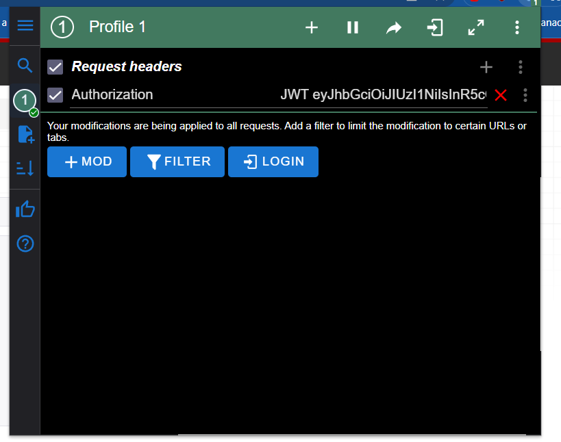

# DJANGO REST FRAMEWORK API for publishing recipes

### Introduction
This API allows users to share their culinary recipes of particular category(like soups, desserts, etc.) with others. Users can rate recipes and leave their reviews on each recipe.

### Features 
* Users can register and login into their accounts.
* Each user can have a profile image(however, this is not obligatory).
* Authenticated users can publish, update and delete recipes.
* Authenticated users can publish up to 3 images for each of their recipes(as well as delete them).
* Authenticated users can publish, update and delete ratings for recipes.
* Authenticated users can publish, update and delete reviews for recipes.
* Admin users create categories. Users than choose category in which they want to publish their recipe.
* Users(authenticated as well as non-authenticated users) can view all categories available, all recipes, all ratings, all reviews and all authenticated users(except admins) with their recipes

### Technologies
* `Django`
* `Django REST Framework`
* `MySQL`

### Project structure
Project consists of two apps:
- recipes
- users

`recipes` app manages all operations for reading, publishing, updating and deleting recipes, ratings and reviews. Also this app allows to see all authenticated users(except admin) with their recipes.

`users` app contains CustomUser model and serializers for this model:serializer for creating new user and and their representation(these serializers are only used in endpoints for authentication). Any other manipulations with authentication are handled by `djoser` package.

### Installation

**To work with this project you need `Python3.9+` installed on your machine**

If you do not have `Python` installed, 
visit official documentation and install it: https://www.python.org/downloads/

Clone repository, using command:
```
    git clone https://github.com/Andrew-157/dj_rest_project_3
```

Then, use command:
```
    cd dj_rest_project_3
```

**Everything shown below assumes you are working from directory `dj_rest_project_3`**

Required packages:
```
    django==4.2.4
    djangorestframework==3.14.0
    mysqlclient==2.2.0
    django-environ==0.10.0
    pillow==10.0.0
    drf-nested-routers==0.93.4
    django-cleanup==8.0.0
    django-filter==23.2
    djoser==2.2.0
    djangorestframework-simplejwt==5.2.2
    django-debug-toolbar==4.1.0
    autopep8==2.0.2
```

If you are using `pipenv` for managing virtual environments, in command line run:
```
    pipenv install
```
And then to activate environment run:
```
    pipenv shell
```

You can also use file `requirements.txt` with pip.
Inside your activated virtual environment, run:
```
    pip install -r requirements.txt
```
For `Windows`
```
    pip3 install -r requirements.txt
```
For `Unix`-based systems

### Run project

**The following steps show how to run project locally(i.e., with DEBUG=True)**

Generate `SECRET KEY` for your project, using the following code:
```python
    import secrets

    secret_key = secrets.token_hex(34)

    print(secret_key)
```

In directory `api` create file `.env`(**check that this file is in `.gitignore`**) and the following line:
```
    SECRET_KEY=<your_secret_key>
```

Then you need to create MySQL database(using MySQL Workbench or any other tool), using `SQL` statement:
```SQL
    CREATE DATABASE <your_database_name>;
```

Next, go to `.env` and, using your database credentials, add the following lines:
```
    DB_NAME=<your_database_name>
    DB_USER=<your_database_user>
    DB_PASSWORD=<your_database_password>
    DB_HOST=<your_database_host>
    DB_PORT=<your_database_port>
```

After that, in command line run:
```
    python manage.py migrate
    python manage.py runserver
```

Go to your browser at the address: 'http://127.0.0.1:8000/', you should be able to see root of the API. `DRF`
provides beautiful client to work with API, so you do not need any additional tools to make requests(only, of course, if you want to use anything else).

### Admin site

If you want to visit admin site, run the following command:
```
    python manage.py createsuperuser
```

Enter credentials for your admin user, and visit 'http://127.0.0.1:8000/admin',
login using the same credentials you used when you created admin user.


### Usage specifics
This API uses `JWT`-token(JSON Web Token) for authenticating user. That means that to be recognized by application as authenticated user, headers sent to application must contain header `Authorization` with value `JWT` followed by space and generated `JWT` token itself. So, to authenticate, you will need:
* start server and visit 'http://127.0.0.1:8000/auth/users' in your browser(or just start server and use this url to make a request using tools you like instead of `DRF` client)
* you will see a form to fill, enter all your credentials(if you are not using `DRF` client, send `POST` request to url 'http://127.0.0.1:8000/auth/users', with body consisting of: username, email, password
and optional image - be sure to use appropriate format or encoding when sending an image)
* visit 'http://127.0.0.1:8000/auth/jwt/create' in your browser and enter necessary credentials(in case you are not using `DRF` client, send `POST` request to this endpoint with body consisting of username and password)
* if entered credentials are valid, you will get response body looking like this: 
    {"access_token": <access_token>,
    "refresh_token": <refresh_token>}, use these tokens to work with the API.

To continue working with `DRF` client, you can provide header, using different browser extensions(
    [Modheader](https://chrome.google.com/webstore/detail/modheader-modify-http-hea/idgpnmonknjnojddfkpgkljpfnnfcklj), for example
):


### API Endpoints

`Users`:
* `POST` '/auth/users/' - create new user
* `GET` '/auth/users/me/' - get currently authenticated user's credentials
* `PUT` '/auth/users/me/' - update currently authenticated user's credentials
* `POST` '/auth/jwt/create/' - get access `JWT` token and refresh `JWT` token

`Recipes`:
* `GET` '/categories/' - get category-list
* `POST` '/categories/' - post new category(accessible only by admin users)
* `GET` '/categories/{pk}/' - get category-detail
* `PUT` '/categories/{pk}/' - update category(accessible only by admin users)
* `DELETE` '/categories/{pk}/' - delete category(accessible only by admin users)
* `GET` '/recipes/' - get recipe-list
* `POST` '/recipes/' - create new recipe(accessible only by authenticated users)
* `GET` '/recipes/{pk}/' - get recipe-detail
* `PUT` '/recipes/{pk}/' - update recipe(accessible only by author of the recipe)
* `DELETE` '/recipes/{pk}/' - delete recipe(accessible only by author of the recipe)
* `GET` '/recipes/{recipe_pk}/ingredients/' - get ingredient-list for recipe
* `POST` '/recipes/{recipe_pk}/ingredients/' - post new ingredient for recipe(accessible only by author of the recipe)
* `GET` '/recipes/{recipe_pk}/ingredients/{pk}/' - get ingredient-detail
* `PUT` '/recipes/{recipe_pk}/ingredients/{pk}/' - update ingredient(accessible only by author of the recipe)
* `DELETE` '/recipes/{recipe_pk}/ingredients/{pk}' - delete ingredient(accessible only by author of the recipe)
* `GET` '/recipes/{recipe_pk}/images/' - get image-list for recipe
* `POST` '/recipes/{recipe_pk}/images/' - post new image for recipe(accessible only by author of the recipe)
* `GET` '/recipes/{recipe_pk}/images/{pk}/' - get image-detail
* `DELETE` '/recipes/{recipe_pk}/images/{pk}' - delete image(accessible only by author of the recipe)
* `GET` '/recipes/{recipe_pk}/ratings/' - get rating-list for recipe
* `POST` '/recipes/{recipe_pk}/ratings/' - post new rating for recipe(accessible only by authenticated users)
* `GET` '/recipes/{recipe_pk}/ratings/{pk}/' - get rating-detail
* `PUT` '/recipes/{recipe_pk}/ratings/{pk}/' - update rating(accessible only by author of the rating)
* `DELETE` '/recipes/{recipe_pk}/ratings/{pk}' - delete rating(accessible only by author of the rating)
* `GET` '/recipes/{recipe_pk}/reviews/' - get review-list for recipe
* `POST` '/recipes/{recipe_pk}/reviews/' - post new review for recipe(accessible only by authenticated users)
* `GET` '/recipes/{recipe_pk}/reviews/{pk}/' - get review-detail
* `PUT` '/recipes/{recipe_pk}/reviews/{pk}/' - update review(accessible only by author of the review)
* `DELETE` '/recipes/{recipe_pk}/reviews/{pk}' - delete review(accessible only by author of the review)

### Testing
Currently this API has only one file with tests with location: 'recipes/tests/test_views.py'
Tests for this API are written using `DRF`'s `APITestCase`:
```python
    from rest_framework.test import APITestCase
```
All test classes inherit from `APITestCase`:
```python
    class CategoriesTests(APITestCase):
        pass
```

To run all project's tests, run:
```
    python manage.py test
```

To run tests only of a particular app, run:
```
    python manage.py test recipes
```

To run tests only in a particular module, run:
```
    python manage.py test recipes.tests.test_views
```

To run particular test class, run:
```
    python manage.py test recipes.tests.test_views.CategoriesTests
```

To run particular test of a test class, run:
```
    python manage.py test recipes.tests.test_views.CategoriesTests.test_get_category_list
```